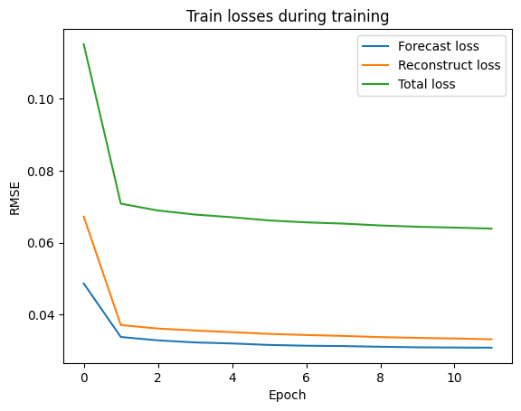

# Loss

- Train Loss
  
- Valid Loss
  

# Result

- epsilon_threshold

|precision|recall|f1|
| ---- | ---- | ---- |
|0.543145|1.000000|0.703946|

- pot_threshold

|precision|recall|f1|
| ---- | ---- | ---- |
|0.641581|1.000000|0.781663|

- bestf1_threshold

|precision|recall|f1|
| ---- | ---- | ---- |
|0.994087|0.998515|0.996296|

